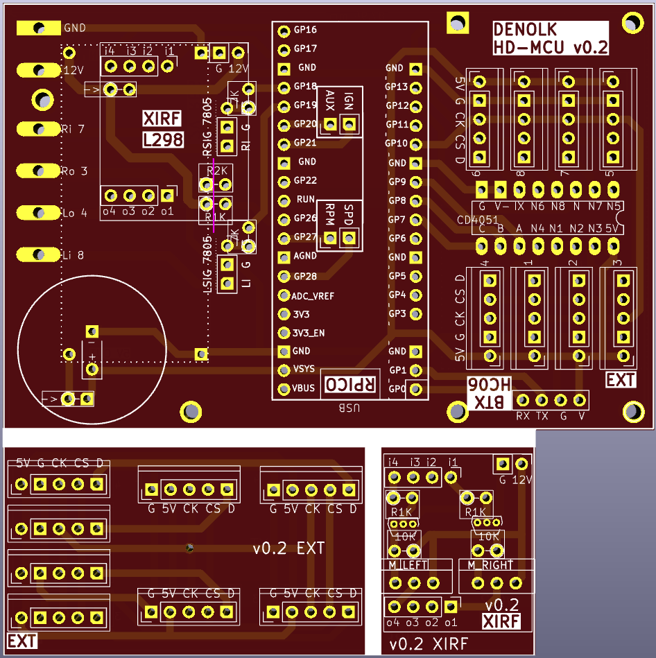
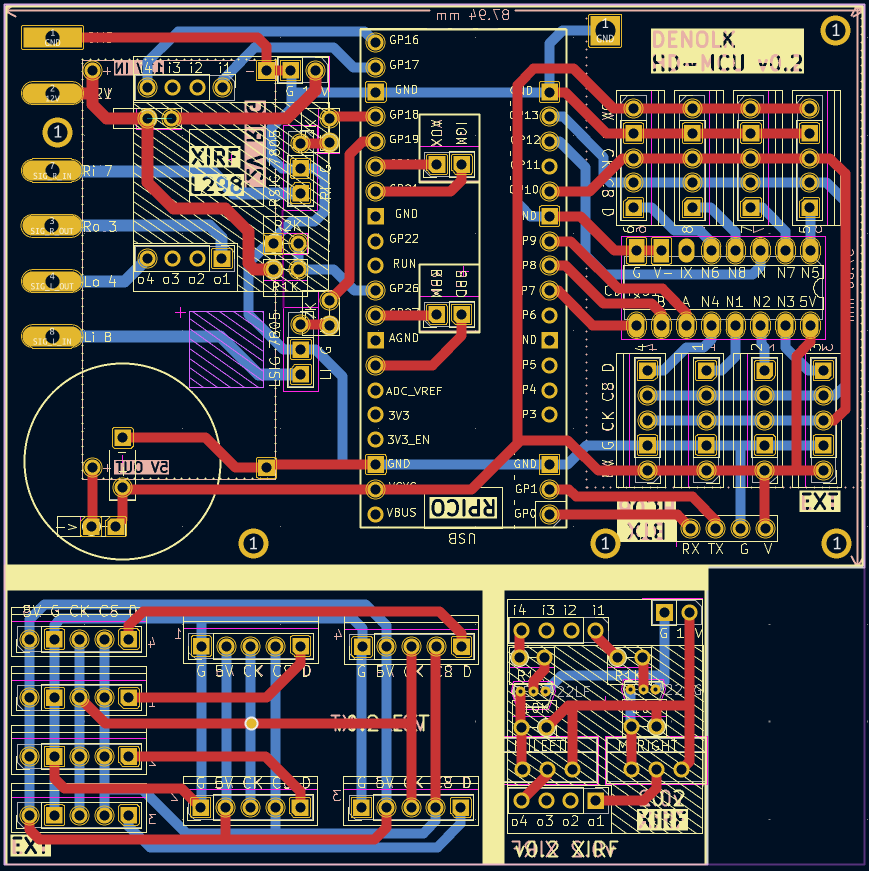

# hd-mcu

## bluetooth supported mcu for harley davidson 99-03 with raspberry pi pico

this is not a ecu but a diy -and for fun- project for a monitoring hardware via an mcu since there is no [can-bus](https://en.wikipedia.org/wiki/CAN_bus) support for 99-03 models. it replaces the default turn signal module (tsm) to provide monitoring features for battery voltage, rpm, voes, ignition, and external thermo sensors via bluetooth to the mobile application. it does not involve a reverse engineering for the original hd-tsm module.

- programmable idle timeout for turn signal
- pcb provides signal switching via h-bridge module or mosfet + oc
- built-in battery voltage sensor
- built-in rpm reader
- built-in temperature sensor via rpi-pico
- aux inputs for ignition and voes signals _(may require custom ignition module ie. [ultima/dyna 2000i](./doc/ud2000i.pdf))_
- vehicle information with editable fields for maintenance records
- external 6x thermocpouler raiser for max6670
- supports up to 8x thermocpouler sensors for various purposes


### supported features

- [x] hardware serial
  - [x] raw ft232 usb serial
- [x] bluetooth serial
  - [x] raw bluetooth serial (hc-06 @ 9600 bps)
  - [x] mobile app
- [ ] obd2/canbus - _for 2004+ models_
  - [ ] available pids
- [x] polling/broadcasting
  - [x] reduced power consumption
  - [x] reduced cpu clock usage
- [x] turn signal flasher module
  - [x] left/right turn signal flasher
  - [x] hazard flasher
  - [x] flash on startup
  - [x] adjustable flash rate
- [x] supported sensor inputs
  - [x] multiplexed thermocouples
    - [x] up to 8 thermocouples
  - [x] direct sensor inputs
    - [x] uptime counter (onboard)
    - [x] voltage sensor (onboard)
    - [x] temperature sensor (onboard)
    - [x] rpm sensor (optional)
    - [x] speed sensor (optional)
    - [x] aux \*2 (optional, ignition, voes ...etc)
  - [ ] tpms
    - [ ] 433mhz receiver implementation
    - [ ] tpms decoder / man-i or man-ii (tbd)
  - [ ] ignition module
    - [ ] dyna 2000i / ultima 2000i timer & pickup
    - [ ] programmable ignition advance
      - [ ] advance curve
      - [ ] temp compensation
      - [ ] rpm compensation

### software

**mobile app**

- platform

  - `react 18.2.0`
  - `react-native: 0.73.2`

- react-native
  - [x] android
  - [ ] ios

### mobile app ui


**mcu firmware**

- platform

  - `nodejs: 18`
  - `kaluma-cli: 1.4.0`
  - [`kalumajs: 1.1.0-beta.4`](https://kalumajs.org/docs/getting-started)

- FLASH: 2044/24 kb
- SRAM: 264 total, 184/57 kb

### hardware

**main tsm assembly**

- 12v-5v buck converter / switching regulator
  - [lm2596 datasheet](./doc/lm2596.pdf)
- raspberry pi pico
  - [pinout](https://pico.pinout.xyz/)
  - [datasheet](./doc/pico-datasheet.pdf)
- hc-06 bluetooth module
  - [datasheet](./doc/hc06.pdf)
- tsm - _(option-1)_ - with mosfet extension board
  - _pick this if your rectifier is 3 pin and charge flux is 12v-15v_
  - [IRF4905 datasheet](./doc/IRF4905.pdf)
- tsm - _(option-2)_ - l298n h-bridge driver module
  - [datasheet](./doc/l298.pdf)
- 5v super capacitor
- 5805 voltage regulator
- 33k resistor
- 10k resistor
- 7.5k resistor
- 4.7k resistor
- 1k resistor
- 1n4001 diode

**thermocouple sensors _(optional)_**

_it would be good to monitor oil temperature as well as both cylinder combustion and exhausts output temperature. (x5)_

- cd4051 multiplexer
  - [datasheet](./doc/cd4051b.pdf)
- max6675 thermocouple digitizer
  - [datasheet](./doc/MAX6675.pdf)
  - k-type thermocouple (maximum of 8)
- use raiser module for up to 6x thermocouples

### pcb

**front**


**back**


**blueprint**


### setup & building & installing

- initialization

  ```bash
  git clone
  npm run install
  ```

- cook everything

  ```bash
  npm run build
  ```

- create mcu firmware

  ```bash
  npm build:mcu
  ```

- flash firmware to pico

  ```bash
  npm run flash:mcu -- /dev/tty.usbmodem2XXX
  ```

- create mobile app

  - _create local build_

    ```bash
    npm run build:app
    ```

  - _create distributable bundle .apk_

    ```bash
    nom run bundle:app
    ```

## usb serial interface

- usb: `115200 bps`
- bt: `9600 bps`

### service interaction

- query only: `[SVC]+[CMD]\n`
- set svc data: `[SVC]+[CMD]=[DATA]\n`

**service list:**
| service | description |
| ------- | ----------- |
| `SYS` | mcu information system |
| `THE` | thermocouple sensor module |
| `TSM` | turn signal module |
| `VHC` | vehicle healthcheck module |
| `VHI` | vehicle information system |
| `IGN` | ignition module \*\* |

**command list**
| command | description |
| ------- | ----------- |
| `INFO` | get information from service|
| `DATA` | get data from service |
| `SET` | send data to service |
| `START` | start monitoring |
| `STOP` | stop monitoring |

**`TSM` extended command set**
| command | description |
| ------- | ----------- |
| `LEFT` | left turn signal |
| `RIGHT` | right turn signal |
| `ALL` | hazard signal |
| `NONE` | turn signal off |

### module interaction

- query only: `[MOD]+[CMD]\n`

**module list:**
| name | description |
| ------- | ----------- |
| `M0` | main mcu module |

**command list**
| command | description |
| ------- | ----------- |
| `DIAG` | execute diagnostic |
| `START` | start ON_DEMAND services in module |
| `STOP` | stop ON_DEMAND services in module |
| `LIST_ALL` | list all services in module |
| `LIST_RUN` | list running services in module |
