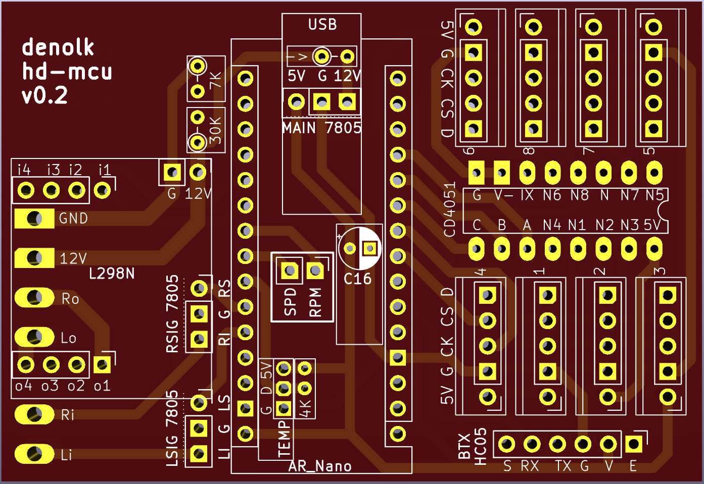
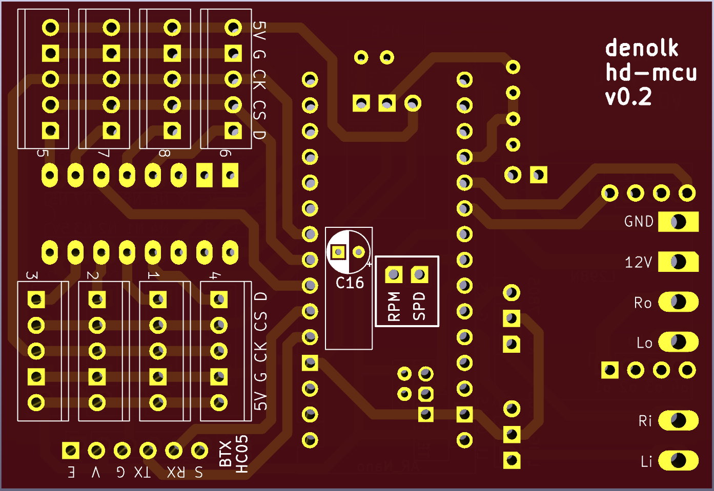
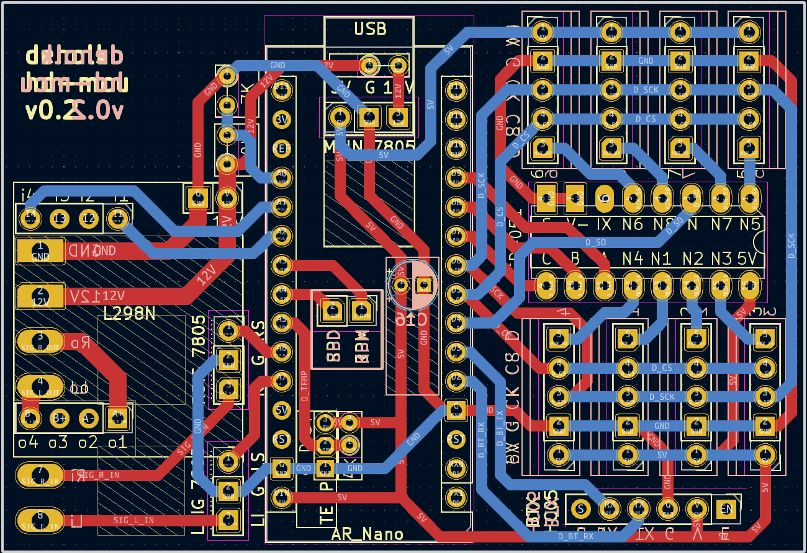

# hd-mcu

## bluetooth supported mcu for harley davidson with arduino nano

### features

- [x] hardware serial
- [x] bluetooth serial
  - [ ] bluetooth ota updates
  - [ ] mobile app
- [x] turn signal flasher module
  - [x] left/right turn signal flasher
  - [x] hazard flasher
  - [x] flash on startup
  - [x] adjustable flash rate
- [x] supported sensor inputs
  - [x] multiplexed thermocouples
    - [x] up to 8 thermocouples
  - [x] direct sensors
    - [x] uptime counter
    - [x] voltage sensor
    - [x] temperature sensor
    - [ ] rpm sensor
    - [ ] speed sensor

### software

- FLASH: 30720/16956 bytes (55%)
- SRAM: 2048/624 bytes (29%)

### hardware

- arduino nano
- hc-05 bluetooth module
- cd4051 multiplexer
- 74hc595 shift register
- l298n h-bridge driver
- max6675 thermocouple amplifier
- k-type thermocouple
- 5805 voltage regulator
- ds18b20 temperature sensor
- 33k resistor
- 10k resistor
- 7.5k resistor
- 4.7k resistor
- 1k resistor
- 1n4001 diode

### pcb

**front**

**back**

**blueprint**

