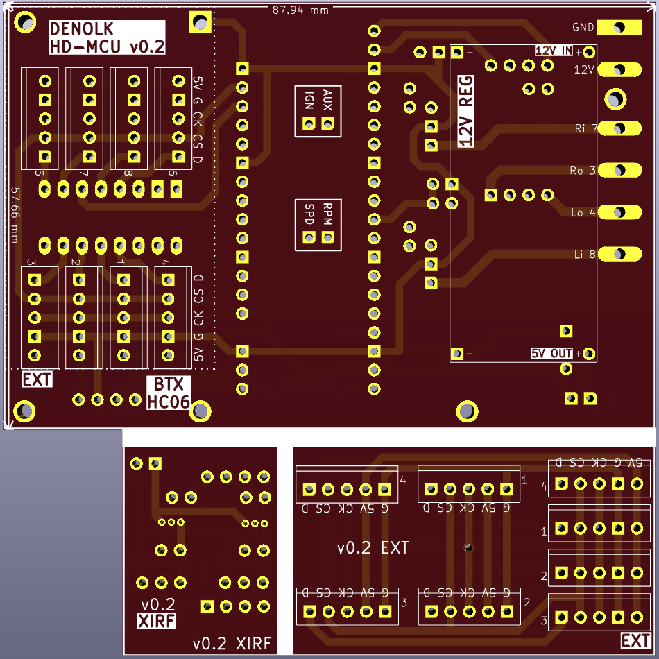

# hd-mcu

## bluetooth supported mcu for harley davidson with raspberry pi pico

### features

- [x] hardware serial
- [x] bluetooth serial
  - [ ] mcu bluetooth ota updates
  - [x] mobile app
    - [x] hot reload
    - [x] code-push ota updates
- [ ] polling from client instead of broadcasting
  - [ ] reduced power consumption
  - [ ] reduced cpu clock usage
- [x] turn signal flasher module
  - [x] left/right turn signal flasher
  - [x] hazard flasher
  - [x] flash on startup
  - [x] adjustable flash rate
- [x] supported sensor inputs
  - [x] multiplexed thermocouples
    - [x] up to 8 thermocouples
  - [x] direct sensors
    - [x] uptime counter
    - [x] voltage sensor
    - [x] temperature sensor
    - [x] rpm sensor
    - [x] speed sensor
    - [x] aux *2

### software

- node/js via [kalumajs](https://kalumajs.org/docs/getting-started)
- FLASH: 2044/24 kb
- SRAM: 264 total, 184/57 kb

### hardware

- raspberry pi pico
- hc-06 bluetooth module
- cd4051 multiplexer
- l298n h-bridge driver
- max6675 thermocouple digitizer
- k-type thermocouple
- 5805 voltage regulator
- 33k resistor
- 10k resistor
- 7.5k resistor
- 4.7k resistor
- 1k resistor
- 1n4001 diode

### pcb

**front**

**back**

**blueprint**

